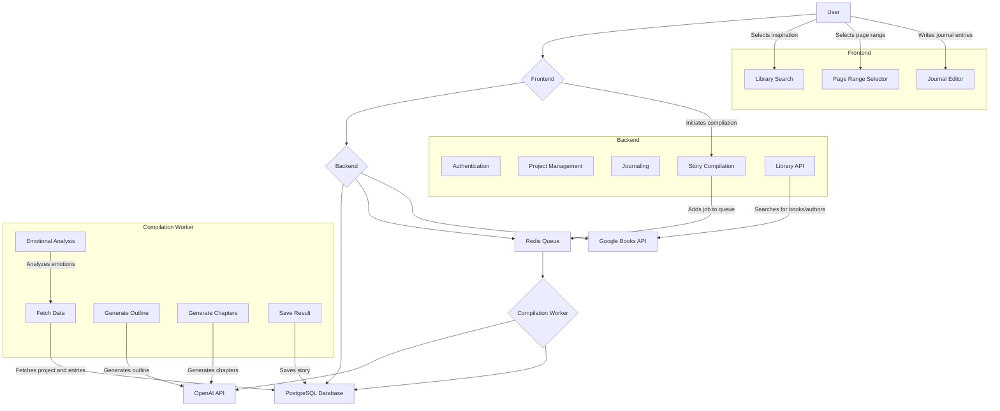

```mermaid
graph TD
    A[User] --> B{Frontend};
    B --> C{Backend};
    C --> D[PostgreSQL Database];
    C --> E[Redis Queue];
    C --> F[Google Books API];
    E --> G{Compilation Worker};
    G --> H[OpenAI API];
    G --> D;

    subgraph Frontend
        B1[Library Search]
        B2[Page Range Selector]
        B3[Journal Editor]
    end

    subgraph Backend
        C1[Authentication]
        C2[Project Management]
        C3[Journaling]
        C4[Story Compilation]
        C5[Library API]
    end

    subgraph Compilation Worker
        G1[Fetch Data]
        G2[Emotional Analysis]
        G3[Generate Outline]
        G4[Generate Chapters]
        G5[Save Result]
    end

    A --"Selects inspiration"--> B1;
    A --"Selects page range"--> B2;
    A --"Writes journal entries"--> B3;
    B --"Initiates compilation"--> C4;
    C4 --"Adds job to queue"--> E;
    C5 --"Searches for books/authors"--> F;
    G1 --"Fetches project and entries"--> D;
    G2 --"Analyzes emotions"--> G1;
    G3 --"Generates outline"--> H;
    G4 --"Generates chapters"--> H;
    G5 --"Saves story"--> D;
```
